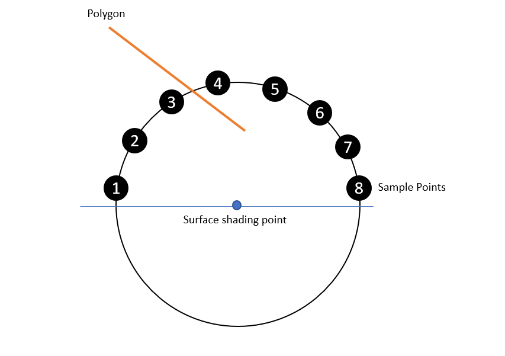
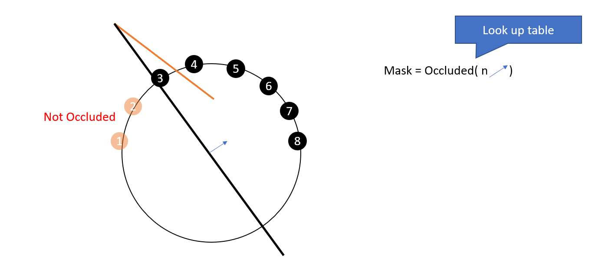
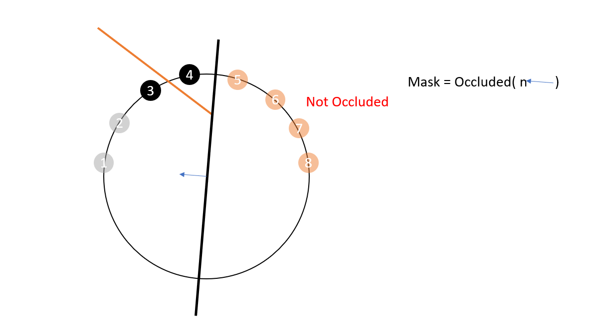
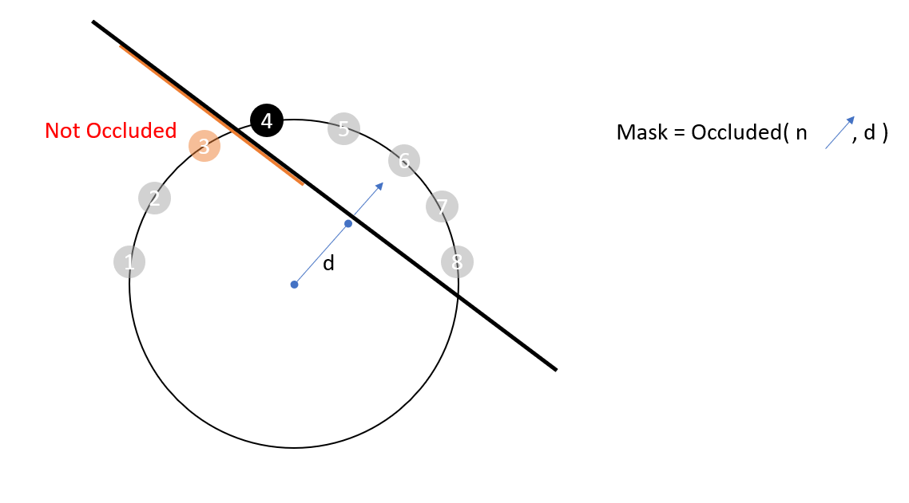
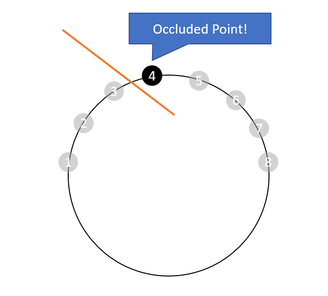

## Lookup based Occulusion Test

## How to run

```
git submodule update --init
premake5 vs2019
```

## Images


## Key Idea







## references 

Samuli Laine, Tero Karras "Two Methods for Fast Ray-Cast Ambient Occlusion"
https://research.nvidia.com/publication/two-methods-fast-ray-cast-ambient-occlusion